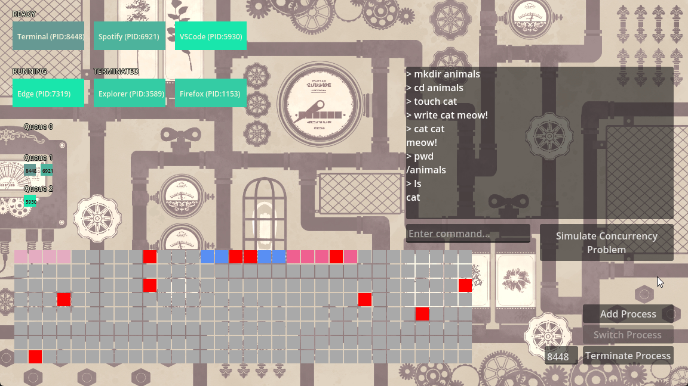

# AlkaOS – Alchemy-Themed OS Simulator

GitHub Repo URL: https://github.com/atelieralice/AlkaOS



## Introduction

Our final project in the third-year Operating Systems course was to build an OS simulator with a theme of our choice. I challenged myself to design and build the entire simulation from scratch within **5 days**.

I went with an alchemy theme, leaning more toward the fantasy side rather than real alchemy, which made the project feel more approachable and more fun to work on.

For this project, I used **C#** with **Godot 4.5**. The project runs on **.NET 8**, so I could use modern C# features. LINQ helped a lot with the parts where I'm filtering and querying lists (process lists, queues, etc.). Godot handles the frontend: drawing the visualizers and managing input/UI, while providing a stable tick source for the simulation via `_PhysicsProcess()`.

Although this was the first project where I worked with Godot's UI tools, I'm happy with how the interface turned out given the tight deadline.

### Key Features
- **Process Management:** Dynamic process creation, switching, and termination with a full Process Control Block (PCB).
- **Scheduling Algorithms:** Round Robin and Multi-Level Feedback Queue (MLFQ) behind a shared interface.
- **Memory Paging:** Simulated page allocation, fragmentation, and swapping with a real-time visualizer.
- **Concurrency:** Custom lock primitives and condition variables with a non-blocking readers-writers demo.
- **In-Memory File System:** Command-line interface supporting directory navigation, file creation, and basic I/O.

## Project Structure

All core logic is written in C#. I tried to keep it modular by putting related systems into their own folders and namespaces.

### Kernel (`AlkaOS.Kernel`)

The main logic of the OS simulation.

| File | Role |
|------|------|
| `Kernel.cs` | Central controller. Creates/terminates processes, drives scheduling each tick, coordinates memory |
| `MemoryManager.cs` | Allocates/frees pages (frames), simulates fragmentation + swapping |
| `Scheduler.cs` | Scheduler interface + implementations. Round Robin as baseline, MLFQ as primary (`AlkaOS.Kernel.Scheduling`) |
| `PCB.cs` | Process Control Block: PID, state, priority, queue level, page table, threads |

#### Threading (`AlkaOS.Kernel.Threading`)

| File | Role |
|------|------|
| `Thread.cs` | Simulated thread model and thread states |
| `ThreadManager.cs` | Helper methods for creating/terminating simulated threads |

### Concurrency (`AlkaOS.Kernel.Concurrency`)

| File | Role |
|------|------|
| `ConcurrencyDemo.cs` | Readers-writers demo, logs into the shared console output window |
| `Lock.cs` | Simple lock primitive for mutual exclusion |
| `ConditionVariable.cs` | Condition variables for waiting/signaling |

### File System (`AlkaOS.Kernel.FileSystem`)

| File | Role |
|------|------|
| `FileSystem.cs` | In-memory file system (directories + files) with basic operations |
| `Console.cs` | Command parser and executor (the shell interface) |

### GUI (`AlkaOS.GUI`)

Everything you see on screen.

| File | Role |
|------|------|
| `ProcessVisualizer.cs` | Displays process states (READY, RUNNING, TERMINATED) |
| `MLFQVisualizer.cs` | Visualizes the MLFQ scheduler and how processes move between queues |
| `MemoryVisualizer.cs` | Renders memory frames, allocation status, and fragmentation |

### Utils

Glue scripts connecting Godot UI elements to kernel actions (`AddProcess.cs`, `TerminateProcess.cs`, `SwitchToNextProcess.cs`).

## OS Concepts Implemented

### Process Management and Scheduling

Each process is tracked through a PCB. Scheduling is abstracted behind a C# interface, and the simulation supports both Round Robin and MLFQ. Processes can be added, switched, and terminated at runtime, and the visualizers reflect changes in real time.

### Memory Management

Memory uses a paging model. Each process gets pages allocated and freed, and the memory visualizer shows frame usage and how fragmentation builds up over time.

### Concurrency

I built basic threading support with custom lock and condition variable primitives, along with a readers-writers demo you can follow through the console logs.

This was the hardest part of the project. At one point, if a race-condition-like situation happened, the app would freeze and memory usage would spike up to around 30 GB. After a lot of debugging I realized the root cause was simpler than I expected: my simulation backend is single-threaded. Making a "simulated thread" wait in a blocking way actually blocks the real Godot main thread that runs the entire simulation loop.

The fix was switching the demo flow to a non-blocking, state-machine approach (basically a "try, and if you can't acquire the lock, retry next tick" pattern), so the main loop keeps running even when a simulated thread is waiting. That eliminated both the freezing and the memory leak.

### File System

The file system is simple but supports creating, writing, reading, and deleting files. Internally it's an in-memory tree of `DirectoryEntry` and `FileEntry` nodes. Each directory stores its subdirectories and files, and navigation works by updating the "current directory" reference.

The console runs on Godot's `RichTextLabel`, which doubles as the output area for the concurrency demo logs. Nothing persists between sessions, but it covers the fundamentals and works as a minimal shell.

## Console Commands

```
pwd                     Print working directory
ls                      List contents
cd <dir>                Change directory (supports cd .., cd /)
mkdir <dir>             Create directory
touch <file>            Create file
rm <name>               Remove file or directory
cat <file>              Print file contents
write <file> <content>  Write to file
```

## Running the Project

- Open the project in [Godot Editor (4.5.2)](https://godotengine.org/download/archive/4.5.2-stable/) with .NET support and press Play.
- Or grab a precompiled Windows build from [Releases](https://github.com/atelieralice/AlkaOS/releases).

Optional build check (requires .NET 8 SDK):

```sh
dotnet build
```

## Credits / Third-Party Assets

This project includes third-party assets used for an educational student project. All rights belong to their respective owners.

- **Background image** (`steam_bg.png`): [素材屋あいりす様](https://sozaiyairis.com/)
- **Project icon** (`flask.png`): Unknown source

## Disclaimer

AlkaOS is a student project for a 3rd-year Operating Systems course. It is not affiliated with or endorsed by any third-party brands.
